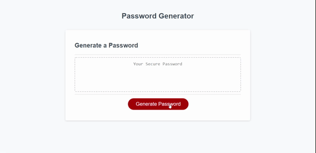

# Easy Secure Password Generator

## Description
Given a partial source code for JavaScript and pre-built HTML and CSS code, created a functional secure password generator.  The secure password generator generates a password based on user choices of password length and types of characters to include in their password (lower case letters, upper case letters, numbers or special characters).  Every time the generate button is selected, new criteria can be selected and an updated password will be generated in the text area for users to be able to copy.

## Live Link
https://ffjt07.github.io/secure-password-generator/
## Github Link
https://github.com/ffjt07/secure-password-generator
## Preview

